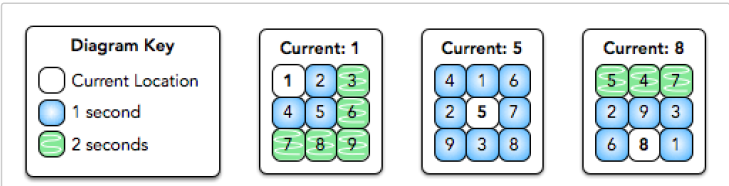

# Keyboard entry time problem

You work at a secret organization where you must type a string of numbers into a console using a 3 × 3 numeric keypad. Every day they mix up the numbers on the keypad.

Use the following rules to calculate the total amount of time it takes to type a string: 
- It takes 0 seconds to move your finger to the first key, and it takes 0 seconds to press the key where your finger is located any number of times.
- You can move your finger from one location to any adjacent key in one second.
- Moving to a non-adjacent key is done as a series of moves to adjacent keys.

**Function Description**

  Implement the method _public int entryTime(String code, String keypad)_ in the editor below. The method should return an integer denoting the minimum amount of time it takes to type the string _code_.

**Constraints:**

- 1 ≤ |s| ≤ 10
- |keypad| = 9
- keypad[i] ∈ [1-9]
